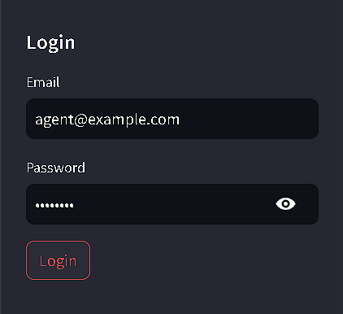
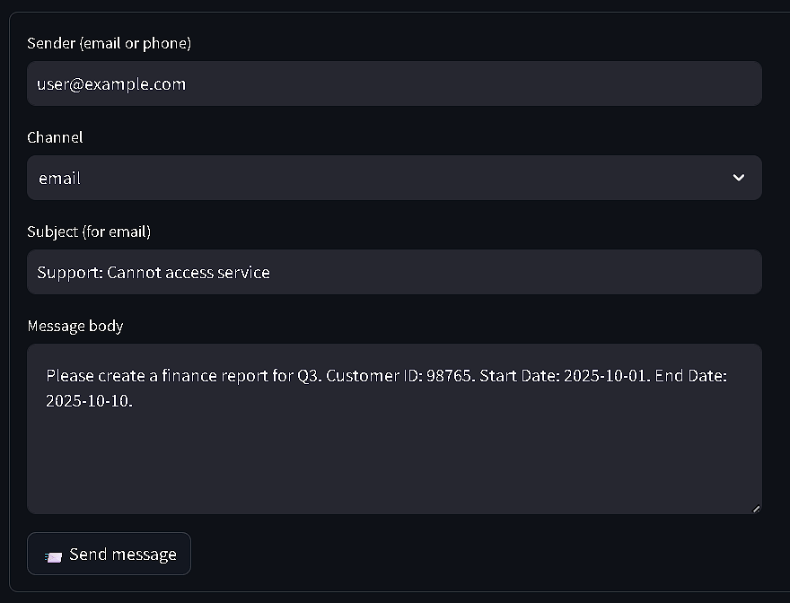
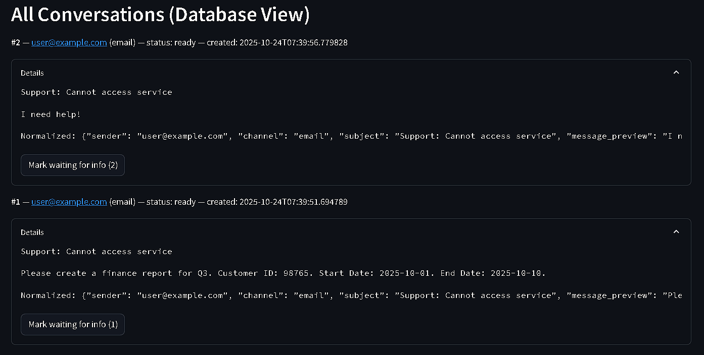
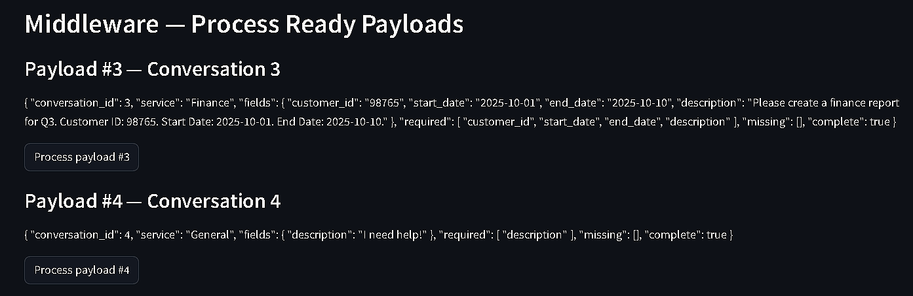
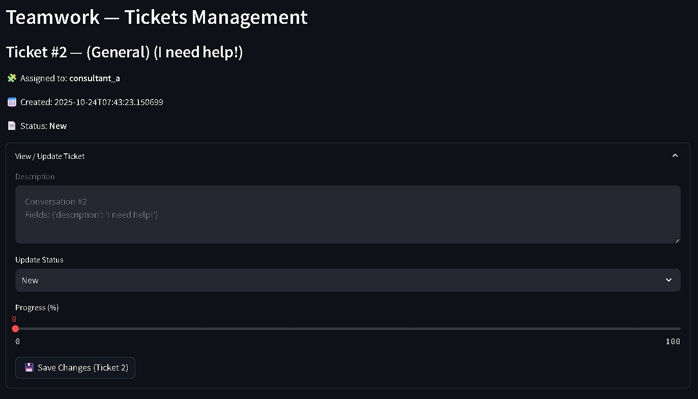
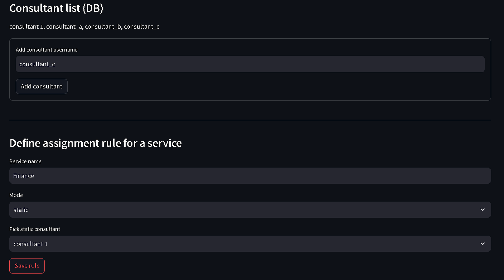
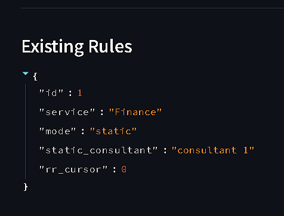

# AI-Backend

AI-Backend is a modular Streamlit application that simulates an intelligent backend workflow. It demonstrates how user messages are collected, classified by an AI Bot, transformed into structured payloads, assigned to consultants based on rules, and managed through a ticketing interface.

---

## 1. Project Overview

This project is a functional prototype that models an AI-driven backend automation system described in the AI Backend Functional Specification.

It allows Business Analysts, Developers, or QA teams to visualize and test:

- Input collection from multiple channels (Email, WhatsApp, Qiscus)
- AI Bot intent detection and ticket field extraction
- Middleware ticket creation workflow
- Consultant assignment logic (Static / Random / Round-Robin)
- Ticket management through a simplified Teamwork-like interface

---

## 2. System Workflow

```
User Message → Input Collector → AI Bot → Middleware → Teamwork Portal
                                           ↘ Consultant Assignment Portal ↙
```

Each module runs locally within the Streamlit interface, sharing data via a lightweight SQLite database.

---

## 3. Environment Setup

Follow these steps to set up and run the application on your local machine.

### Step 1: Clone the Repository

```bash
git clone https://github.com/phunghoang1909/AI-Backend.git
cd AI-Backend
```

### Step 2: Create a Virtual Environment

It is recommended to use a virtual environment to isolate project dependencies.

**Windows:**

```bash
python -m venv .venv
.venv\Scripts\activate
```

**macOS / Linux:**

```bash
python3 -m venv .venv
source .venv/bin/activate
```

### Step 3: Install Requirements

```bash
pip install -r requirements.txt
```

### Step 4: Run the Application

```bash
streamlit run app.py
```

The app will start locally and open automatically in your browser (default: http://localhost:8501).

---

## 4. Application Walkthrough

After launching, you will see a sidebar for authentication and navigation between modules.


### Login Credentials

| Role  | Email               | Password | Permissions                    |
|-------|---------------------|----------|--------------------------------|
| Admin | admin@example.com   | admin123 | Manage consultants and rules   |
| Agent | agent@example.com   | agent123 | Simulate user messages and tickets |

---

### A. Chat / Input Collector

This page simulates message intake from Qiscus, Email, or WhatsApp.

1. Log in as agent@example.com
2. Select Chat / Input Collector in the sidebar
3. Enter sender details, message subject, and body
4. Use one of the templates:
   - Missing Info Example – to trigger AI clarifications
   - Complete Ticket Example – to create a valid ticket
5. Submit the message
   - If information is complete → marked Ready
   - If incomplete → marked Waiting for Info


---

### B. Conversations

View all stored messages with:

- Sender and channel information
- Subject and message content
- Current conversation status

You can also manually mark a conversation as "waiting for info" for testing.


---

### C. Process (Middleware)

This module processes ready payloads and simulates the backend workflow:

1. Go to Process (Middleware)
2. Review pending payloads created by the AI Bot
3. Click Process Payload to:
   - Apply consultant assignment rules
   - Automatically create a new ticket in the Teamwork simulation
4. The payload status changes to "processed"

---

### D. Tickets (Teamwork)

Displays all tickets created by the middleware.

Each ticket shows:

- Ticket ID
- Title and description
- Assigned consultant
- Current status (New / In Progress / Closed)
- Created date

**To mark a ticket complete:**

1. Expand the ticket panel
2. Change the Status to Closed
3. Click Save Changes to update

---

### E. Consultant Assignment Portal (Admin)

1. Log out, then log in as admin@example.com
2. Navigate to Consultant Assignment Portal (Admin)
3. View or add consultants
4. Configure assignment rules per service:
   - Static – always assign to one consultant
   - Random – assign randomly among consultants
   - Round-Robin – rotate between consultants
5. Save the rule, then test it by creating new tickets


---

## 5. Database

All data is stored in a local SQLite file named `ai_backend_demo.db`.

| Table         | Purpose                            |
|---------------|------------------------------------|
| conversations | Stores raw and normalized messages |
| payloads      | Stores AI Bot analysis results     |
| tickets       | Tracks created tickets             |
| consultants   | Stores consultant list             |
| rules         | Stores assignment rules            |

To reset the application data:

```bash
rm ai_backend_demo.db
```

---

## 6. Project Structure

| File                   | Description                                        |
|------------------------|----------------------------------------------------|
| app.py                 | Main Streamlit application and page routing        |
| auth.py                | Authentication logic                               |
| db.py                  | Database schema and helper functions               |
| input_collector.py     | Simulated Qiscus/Email/WhatsApp input              |
| ai_bot.py              | AI Bot: intent classification and payload creation |
| middleware.py          | Middleware: processes ready payloads               |
| teamwork.py            | Ticket management simulation                       |
| consultant_portal.py   | Admin rule configuration                           |
| requirements.txt       | Python dependencies                                |

---

## 7. How to Demo the Workflow

To demonstrate the full end-to-end process:

1. **Login as Agent**
   - Use the Input Collector to send both incomplete and complete messages
   - Observe how the AI Bot classifies and processes each case

2. **View Conversations**
   - Check stored messages and confirm their current statuses

3. **Process Payloads**
   - In the Middleware page, process ready payloads to simulate ticket creation

4. **Inspect Tickets**
   - Review tickets in the Teamwork Portal, update progress, and close tickets

5. **Login as Admin**
   - Define or adjust consultant assignment rules
   - Re-run ticket creation to see the effect of these rules

---

## 8. Customization and Extension

This project is modular and can be extended with real integrations:

- Replace mock logic in `ai_bot.py` with actual OpenAI API calls
- Connect the Input Collector to a live Qiscus Webhook
- Replace Teamwork simulation with Teamwork API integration
- Add automated email reminders and ticket updates
- Implement JWT or OAuth2 authentication for multiple users

---

## 9. Troubleshooting

| Issue                  | Cause                                    | Solution                                              |
|------------------------|------------------------------------------|-------------------------------------------------------|
| No tickets created     | Message missing required fields          | Use "Complete Ticket Example" message                 |
| Database error         | Locked file                              | Stop Streamlit, delete ai_backend_demo.db, restart   |
| Missing submit button  | Using outdated version of input_collector.py | Update to the latest version                      |

---
